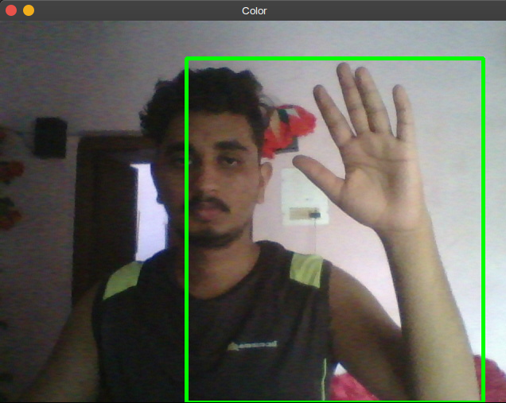

# Motiondetector
#### motiondetector using python which records the start time of motion and end time of motion in a csv file

# Technology Used 

#### Python
#### Opencv
#### Pandas
#### Numpy 

# Usage 

#### Python motiondetector.py 
#### This will generate a times.csv file containing start and end time of the motion 

# Images
 </img>
